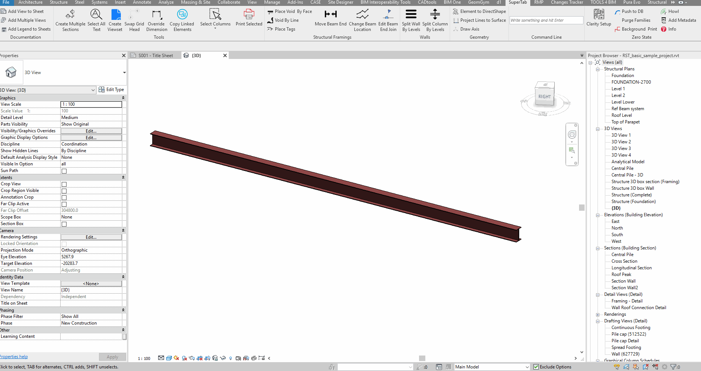

# ReviTab
WIP toolbar for Revit. 

## DOCUMENTATION

## TOOLS

# STRUCTURAL FRAMINGS

# WALLS

## Split Wall by Levels
Copy a wall in place and set its Top and Base constraints to the level it intersects. 
Note: 
1. The wall should not have a top/bottom offset applied; 
2. The original wall will be deleted. 

# GEOMETRY

## Element to DirectShape

## Project Lines to Surface

## Draw Axis

# COMMAND LINE

Call methods directly:
keywords: 
* select
+ create
- delete

\> larger

< shorter

= equal

! not equal

examples:

\*Structural Framing -> select all structural framings in the active view.

\*Structural Framing+Length>10000 -> select all structural framings in the active view longer than 10m. 

\*Walls+Mark=aa -> select all walls with a Mark equal to 'aa'

sheets: all -> select all Sheets

sheets: A101 A103 A201 -> select Sheets by Sheet Number

tblocks: all -> select all Title Blocks

# ZERO STATE

## Push to DB
Export selected parameters to a [db](https://remotemysql.com)

Data can be then visualized with online dashboards like [grafana](https://giobel.grafana.net/d/TS8vWBriz/project-2?orgId=1) 

or [desktop](https://github.com/giobel/rvtDashboard) apps

## Background Print
Open a model in background and print its drawings. The printer setting should be already defined in the Revit model. The default printer should be Bluebeam.

## Purge Families
Purge families and leave only a type called Default. Requires the Purge Unused that can be found in the Revit Purge Unused branch. Credits: Matt Taylor https://gitlab.com/MattTaylor/RevitPurgeUnused/blob/master/PurgeTool.vb

## Installation
Extract the content of the release zip file in %AppData%\Autodesk\Revit\AddIns\20xx
