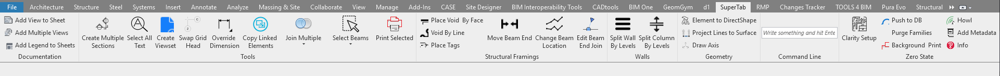

# ReviTab
WIP toolbar for Revit. 

## Add View to Sheet
Add the active view to a sheet providing its number.

## Add Multiple Views
Select multiple views in the project browser and add them to a sheet providing its number.

## Create Multiple Sections
credits: Danny Bentley and others. Create a section from a list of elements that have a location curve.

## Select All Text
Select all text notes in the project and launch the spelling check.

## Create Viewset
Create a viewset from a list of sheet numbers.

## Swap Grid Head
Swap the grid head bubble in the active view. Note: does not work for multi-segmented grids.

## Override Dimension
Set the text dimension to "" for a selected dimension. Does not work on multiple elements or multi-segment dimensions.

## Place Void By Face
Add one ore more voids to a beam face providing the distance(s) from the beam start, mid or end point and its size.

## Void By Line
Place a void by face at the intersection between a 2d line (on plan) and a beam. The opening will acquire distance and size from the line style name.

## Place Tags
Modeless window that calculates the distance from the origin to the beam centerpoint and saves it as Mark. The user can accept or refuse the changes.

## Move beam end
Move a beam or multiple beams end point to another element location curve closest point.

## Command Line
Call methods directly:
keywords: 
* select
+ create
- delete
> larger
< shorter
= equal
! not equal

examples:

\*Structural Framing -> select all structural framings in the active view.

\*Structural Framing+Length>10000 -> select all structural framings in the active view longer than 10m. 

\*Walls+Mark=aa -> select all walls with a Mark equal to 'aa'

Sheets: all -> select all Sheets

\Sheets: A101 A103 A201 -> select Sheets by Sheet Number

## Background Print
Open a model in background and print its drawings.

## Purge Families
Purge families and leave only a type called Default. Requires the Purge Unused that can be found in the Revit Purge Unused branch. Credits: Matt Taylor https://gitlab.com/MattTaylor/RevitPurgeUnused/blob/master/PurgeTool.vb
